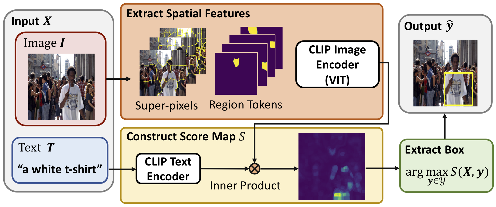
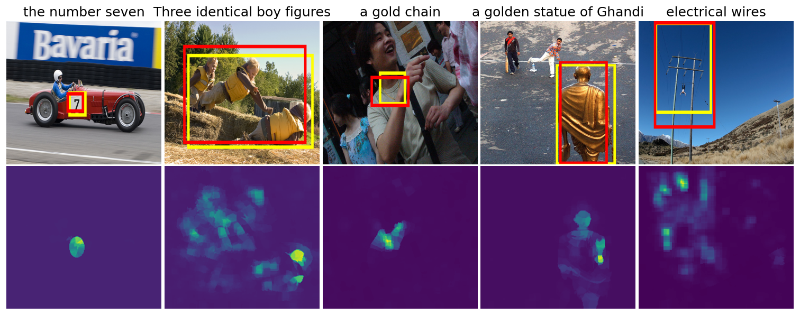

# Adapting CLIP For Phrase Localization Without Further Training

ssh aren10@ssh.ccv.brown.edu
interact -n 2 -t 12:00:00 -m 32g -q gpu  -X -g 2 -f geforce3090
module load cuda/11.1.1
module load cudnn/8.2.0
module load anaconda/2020.02
source /gpfs/runtime/opt/anaconda/2020.02/etc/profile.d/conda.sh

[Jiahao Li](https://www.linkedin.com/in/jiahaoli95/), [Greg Shakhnarovich](https://home.ttic.edu/~gregory/), [Raymond A. Yeh](https://raymond-yeh.com)<br/>
Toyota Technological Institute at Chicago (TTIC)<br/>



The repository contains Pytorch implementation of Adapting CLIP For Phrase Localization Without Further Training.
If you used this code for your experiments or found it helpful, please consider citing the following paper:

<pre>
@inproceedings{Li_ARXIV_2022,
  author = {Jiahao Li and Greg Shakhnarovich and Raymond A. Yeh},
  title = {Adapting CLIP For Phrase Localization Without Further Training},
  journal={arXiv preprint arXiv:2204.03647,
  year = {2022},
}
</pre>


## Dependencies
Following [CLIP](https://github.com/openai/CLIP)'s installation procedure
```bash
$ conda install --yes -c pytorch pytorch=1.7.1 torchvision cudatoolkit=11.0
$ pip install ftfy regex tqdm
$ pip install git+https://github.com/openai/CLIP.git
```
Specifically, we are using commit [40f5484](https://github.com/openai/CLIP/commit/40f5484c1c74edd83cb9cf687c6ab92b28d8b656).

## Data
All of the data should be put in a `data` directory in the root dir of the repo.

1. Download the [Flickr](http://shannon.cs.illinois.edu/DenotationGraph/) and [VG](https://visualgenome.org/api/v0/api_home.html) images, to `data/flickr` and `data/vg` respectively.
2. Download Flickr30k Entities annotations using `cd data/flickr && git clone https://github.com/BryanPlummer/flickr30k_entities.git`.
3. Download the [ZSG](https://github.com/TheShadow29/zsgnet-pytorch/blob/master/DATA_README.md) annotations from [this link](https://drive.google.com/open?id=1oZ5llnA4btD9LSmnSB0GaZtTogskLwCe) to `data/ds_csv_ann`:

After setting up, the `data` dir should have the following structure
```
data
data
├── flickr
  ├── flickr30k_entities
      ├── Annotations
      ├── Sentences
      ├── test.txt
      ├── train.txt
      └── val.txt
  └── flickr30k_images
├── vg
  ├── VG_100K
  └── VG_100K_2
└── ds_csv_ann
  ├── flickr30k
  ├── flickr30k_c0
  ├── flickr30k_c1
  └──vg_split
```

## Usage
To run evaluation on the ZSG dataset as reported in the paper, please refer to a full list of arguments in ``eval.py`` to specify the dataset, architecture, etc.

For example, the following command runs ViT-L/14 architecture on the first 500 examples of the Flickr S1 validation set with an IoU threshold of 0.5.
```bash
python eval.py --model vit14 --dataset flickr_s1_val --iou_thr 0.5 --num_samples 500
```
## Results

